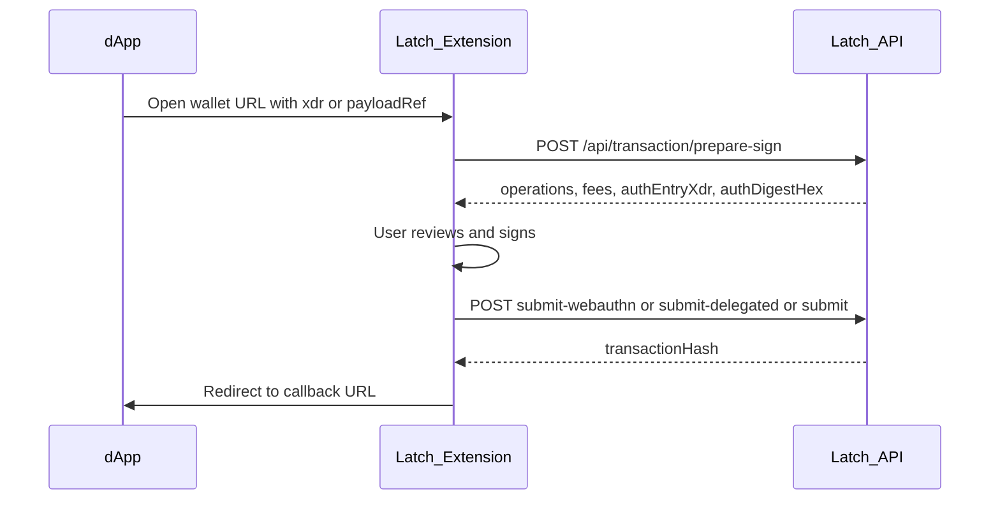

# Latch External Sign API — Integration Guide

**Audience:** Latch browser extension, web frontend, and third-party dApp developers.  
**Base URL (production):** `https://v0-latch-stellar.vercel.app`  
**Base URL (local):** `http://localhost:3000`

This document describes how to integrate with Latch's **external sign** flow: a dApp redirects the user to the Latch wallet with an unsigned Soroban transaction XDR; the wallet simulates, shows a review screen, signs a Soroban authorization entry, optionally submits, and redirects back to the dApp.

> Internal implementation spec: [`LATCH_API_EXTERNAL_SIGN_SPEC.md`](LATCH_API_EXTERNAL_SIGN_SPEC.md)

---

## Overview

Latch smart accounts sign **Soroban authorization entries**, not full transaction envelopes. The API's role:

| Step | Who | What |
|------|-----|------|
| Build unsigned tx | dApp (or `build-sign-demo` for testing) | Soroban invoke envelope XDR |
| Prepare | `POST /api/transaction/prepare-sign` | Simulate, return review metadata + auth templates |
| Sign | Wallet (extension) | Passkey / Freighter / Phantom / mnemonic |
| Submit | Existing submit routes | Broadcast signed tx |
| Callback | Wallet → dApp | Redirect with `status` + `txHash` |



---

## Wallet URL contract

Open the extension sign-request page with query parameters:

| Param | Required | Description |
|-------|----------|-------------|
| `network` | yes | `testnet` or `mainnet` |
| `account` | yes | Smart account C-address |
| `xdr` | one of xdr/payloadRef | Base64 unsigned transaction envelope |
| `payloadRef` | one of xdr/payloadRef | Reference from `POST /api/sign-payload` (oversized payloads) |
| `callback` | yes | dApp URL to redirect after sign/reject/error |
| `requestId` | no | Correlation id echoed on callback |
| `submit` | no | `true` (default) — wallet submits after sign → callback `txHash`; `false` — wallet returns signed material for **dApp submit** |

**Recommended interoperability baseline:** `submit=false` so the dApp broadcasts `signedTxXdr` with its own RPC. Use `submit=true` when the product wants wallet-sponsored broadcast.

**Example (inline XDR):**

```
chrome-extension://<EXTENSION_ID>/sign-request.html?network=testnet&account=C...&xdr=AAAA...&callback=https%3A%2F%2Fdapp.example%2Fcallback&requestId=550e8400-e29b-41d4-a716-446655440000&submit=true
```

### Callback URLs

**Success:**

```
{callback}?requestId=...&status=signed&txHash=...&network=testnet
```

Optional hash fragment when `submit=false`:

```
#signedTxXdr=...&signedAuthEntry=...
```

Prefer `#signedTxXdr` for dApp-submit flows (complete envelope ready for Soroban RPC). `signedAuthEntry` remains available when clients need the auth entry separately.

**Reject / error:**

```
{callback}?requestId=...&status=rejected|error&code=...&message=...
```

---

## Endpoints

### `POST /api/transaction/prepare-sign` (P0)

Simulate an external unsigned XDR and return signing material + human-readable review rows. **Does not sign or submit.**

**Auth:** None (public, read-only simulation).

**Context-rule policy (portable contract for Go):**

| Invoke target | Rule discovery | `requireMatchedContextRule` |
|---------------|----------------|-------------------------------|
| SAC / dApp contract (`CallContract`) | Prefer `CallContract(target)`; else fail | **true** → `NO_CONTEXT_RULE` if not matched |
| Swap router | Default rule | false |
| Smart account itself (admin / `add_context_rule` setup) | Default rule (`targetContractId === smartAccountAddress`) | **false** |

Self-invoke detection is intentional and narrow: only when the first Soroban invoke’s contract address equals `smartAccountAddress`. Do **not** skip CallContract matching for arbitrary targets.

**Request:**

```json
{
  "network": "testnet",
  "smartAccountAddress": "C...",
  "unsignedTxXdr": "AAAA...",
  "signerType": "passkey",
  "signerG": "G..."
}
```

| Field | Type | Required | Notes |
|-------|------|----------|-------|
| `network` | `"testnet"` \| `"mainnet"` | yes | |
| `smartAccountAddress` | string | yes | C-address that must authorize |
| `unsignedTxXdr` | string | yes | Base64 transaction envelope |
| `signerType` | `"passkey"` \| `"phantom"` \| `"freighter"` | no | Populates delegated fields when `freighter` |
| `signerG` | string | no | Required when `signerType` is `freighter` |

**Response `200`:**

```json
{
  "network": "testnet",
  "smartAccountAddress": "C...",
  "txXdr": "AAAA...",
  "authEntryXdr": "AAAA...",
  "authEntriesXdr": ["AAAA..."],
  "smartAccountAuthEntryIndex": 0,
  "contextRuleId": 1,
  "authDigestHex": "abc123...",
  "signaturePayloadHex": "...",
  "validUntilLedger": 1234567,
  "simulationResultXdr": "...",
  "smartAccountAuthEntryXdr": "AAAA...",
  "gAddressPreimageXdr": "AAAA...",
  "gAddressEntryTemplateXdr": "AAAA...",
  "estimatedFeeXlm": "0.0000123",
  "feeLabel": "Fast",
  "operations": [
    {
      "type": "sac_transfer",
      "summary": "Transfer 10.0000000 USDC to GABC...DEF",
      "details": {
        "asset": "USDC",
        "amount": "10.0000000",
        "recipient": "GABC...DEF",
        "contractId": "C..."
      }
    }
  ],
  "warnings": []
}
```

Response fields match the extension's `BuildSendTxResponse` plus `operations` and `warnings`. Feed directly into the same sign-and-submit path as `build-send`.

**Errors:**

| HTTP | `code` | When |
|------|--------|------|
| 400 | `validation_error` | Missing/invalid body |
| 400 | `invalid_network` | Unknown network or mainnet not configured |
| 400 | `invalid_xdr` | Cannot parse XDR |
| 400 | `account_mismatch` | Tx does not require auth from `smartAccountAddress` |
| 400 | `simulation_failed` | Soroban simulation failed |
| 400 | `unsupported_tx` | No Soroban invoke operations |
| 500 | `internal_error` | Server error |

**curl:**

```bash
curl -s -X POST "$LATCH_API_URL/api/transaction/prepare-sign" \
  -H 'Content-Type: application/json' \
  -d '{
    "network": "testnet",
    "smartAccountAddress": "C...",
    "unsignedTxXdr": "AAAA...",
    "signerType": "passkey"
  }' | jq .
```

---

### `POST /api/transaction/build-sign-demo` (P1)

**Dev only** — returns an unsigned XDR for E2E testing. Returns `403 forbidden` in production.

**Request:**

```json
{
  "network": "testnet",
  "smartAccountAddress": "C...",
  "demoAction": "transfer",
  "recipient": "G...",
  "amount": "1",
  "assetId": "native"
}
```

| `demoAction` | Behavior |
|--------------|----------|
| `noop` | Minimal native self-transfer smoke test (still requires CallContract on native SAC) |
| `transfer` | Unsigned SAC transfer (requires matched CallContract send rule) |

**Response `200`:**

```json
{
  "unsignedTxXdr": "AAAA...",
  "description": "Transfer 1 XLM to GABC...DEF",
  "network": "testnet",
  "smartAccountAddress": "C..."
}
```

Additional error: `409 NO_CONTEXT_RULE` with `suggestedAction: "setup_transfer_rule"` when no matched CallContract rule exists. Default-only accounts are **not** enough.

**Dev-only, production-grade contract:** Build/validation/error shape must stay portable for Go non-prod parity even though production returns `403 forbidden`.

**Sample harness:** [`/dev/sign-demo`](/dev/sign-demo) — build → optional setup via Latch wallet → `signTransaction({ submit: false })` → dApp RPC submit.

---

### `POST /api/sign-payload` (P2)

Store an oversized sign payload; returns a short reference for the wallet URL.

**Request:**

```json
{
  "network": "testnet",
  "smartAccountAddress": "C...",
  "unsignedTxXdr": "AAAA...",
  "callback": "https://dapp.example/dev/sign-demo/callback",
  "requestId": "550e8400-e29b-41d4-a716-446655440000",
  "origin": "https://dapp.example",
  "submit": true,
  "ttlSeconds": 600
}
```

**Response `201`:**

```json
{
  "payloadRef": "sp_7f3a9c2e1b4d8e0f1a2b3c4d5e6f7089",
  "expiresAt": "2026-06-18T12:10:00.000Z"
}
```

- `callback` must be `https://` or `http://localhost` / `http://127.0.0.1`
- TTL default 600s, max 3600s
- Payloads stored in Postgres with TTL; no private keys or signatures

---

### `GET /api/sign-payload/:payloadRef` (P2)

Fetch stored payload (single-use — consumed after first successful GET).

**Response `200`:** Same shape as POST body (excluding `ttlSeconds`).

| HTTP | `code` | When |
|------|--------|------|
| 404 | `not_found` | Unknown or already consumed ref |
| 410 | `expired` | Past TTL |

---

## Submit endpoints (existing — unchanged)

After `prepare-sign`, use the same submit route as the in-app send flow:

| Signer | Endpoint |
|--------|----------|
| Passkey | `POST /api/transaction/submit-webauthn` |
| Freighter / mnemonic | `POST /api/transaction/submit-delegated` |
| Phantom | `POST /api/transaction/submit` |

**Passkey submit body:**

```json
{
  "txXdr": "AAAA...",
  "authEntryXdr": "AAAA...",
  "sigDataXdr": "04...",
  "keyDataHex": "04...",
  "contextRuleId": "1",
  "chromeExtensionId": "optional"
}
```

**Delegated submit body:**

```json
{
  "txXdr": "AAAA...",
  "smartAccountAuthEntryXdr": "AAAA...",
  "gAddressEntryTemplateXdr": "AAAA...",
  "signedAuthEntryBase64": "<base64 of raw 64-byte Ed25519 signature>",
  "signerAddress": "G..."
}
```

> `signedAuthEntryBase64` is the **raw 64-byte Ed25519 signature**, not the full signed auth entry XDR.

**Phantom submit body:**

```json
{
  "txXdr": "AAAA...",
  "authEntryXdr": "AAAA...",
  "authSignatureHex": "abc123...",
  "prefixedMessage": "Stellar Smart Account Auth:\n<authDigestHex lowercase>",
  "publicKeyHex": "...",
  "contextRuleId": "1"
}
```

**Submit response:**

```json
{
  "transactionHash": "abc123...",
  "hash": "abc123...",
  "status": "SUCCESS"
}
```

---

## Extension integration (`latch-web-extension`)

Call API routes from the **background service worker only**, never from popup/UI directly.

### HTTP client

Add to `apps/extension/src/background/backend.ts`:

```ts
export async function prepareSign(req: PrepareSignRequest): Promise<PrepareSignResponse> {
  return await jsonFetch<PrepareSignResponse>('/api/transaction/prepare-sign', {
    method: 'POST',
    body: JSON.stringify(req),
  })
}

export async function fetchSignPayload(payloadRef: string): Promise<SignPayloadBody> {
  return await jsonFetch<SignPayloadBody>(`/api/sign-payload/${payloadRef}`)
}
```

### CORS and cookies

- Extension `fetch` uses `chrome-extension://` origin
- Configure `API_CORS_ALLOWED_ORIGINS` to include your extension id
- `prepare-sign` and `build-sign-demo` are **public** (no session cookie)
- Submit routes follow existing extension patterns

### Sign flow

1. Parse wallet URL params (`xdr` or `payloadRef`)
2. If `payloadRef`, `GET /api/sign-payload/:ref` first
3. `POST /api/transaction/prepare-sign` with `unsignedTxXdr`, `network`, `account`, `signerType`
4. Show `operations[]` and `warnings[]` in review UI
5. Sign auth entry locally (same as `build-send` response)
6. Submit via existing route for signer type
7. Redirect to `callback` with result query params

---

## Frontend / sample dApp

Local demo pages:

- [`/dev/sign-demo`](/dev/sign-demo) — build demo tx and open wallet
- [`/dev/sign-demo/callback`](/dev/sign-demo/callback) — displays callback query params

Set `NEXT_PUBLIC_EXTENSION_WALLET_URL` to your extension sign-request page URL.

**Typical flow:**

```ts
const buildRes = await fetch('/api/transaction/build-sign-demo', {
  method: 'POST',
  headers: { 'Content-Type': 'application/json' },
  body: JSON.stringify({
    network: 'testnet',
    smartAccountAddress: 'C...',
    demoAction: 'transfer',
    recipient: 'G...',
    amount: '1',
    assetId: 'native',
  }),
})
const { unsignedTxXdr } = await buildRes.json()

const params = new URLSearchParams({
  network: 'testnet',
  account: 'C...',
  xdr: unsignedTxXdr,
  callback: `${window.location.origin}/dev/sign-demo/callback`,
  requestId: crypto.randomUUID(),
  submit: 'true',
})
window.location.href = `${EXTENSION_WALLET_URL}?${params}`
```

---

## Third-party integration (any language)

### Steps

1. **Build** an unsigned Soroban transaction envelope (base64 XDR) that requires authorization from the user's Latch smart account C-address.
2. **Redirect** the user to the Latch wallet URL with `xdr`, `network`, `account`, and `callback`.
3. For payloads > ~2 KB URL-safe length, `POST /api/sign-payload` and pass `payloadRef` instead of `xdr`.
4. **Handle callback** — read `status`, `txHash`, `requestId` from query string.

### TypeScript example

```ts
const LATCH_API = 'https://v0-latch-stellar.vercel.app'

async function prepareForReview(unsignedTxXdr: string, smartAccount: string) {
  const res = await fetch(`${LATCH_API}/api/transaction/prepare-sign`, {
    method: 'POST',
    headers: { 'Content-Type': 'application/json' },
    body: JSON.stringify({
      network: 'testnet',
      smartAccountAddress: smartAccount,
      unsignedTxXdr,
      signerType: 'passkey',
    }),
  })
  if (!res.ok) {
    const err = await res.json()
    throw new Error(err.message ?? err.error)
  }
  return res.json()
}
```

### Python example

```python
import requests

LATCH_API = "https://v0-latch-stellar.vercel.app"

def prepare_for_review(unsigned_tx_xdr: str, smart_account: str) -> dict:
    r = requests.post(
        f"{LATCH_API}/api/transaction/prepare-sign",
        json={
            "network": "testnet",
            "smartAccountAddress": smart_account,
            "unsignedTxXdr": unsigned_tx_xdr,
            "signerType": "passkey",
        },
        timeout=60,
    )
    r.raise_for_status()
    return r.json()
```

---

## TypeScript types

```ts
export type Network = 'testnet' | 'mainnet'
export type SendSignerType = 'passkey' | 'phantom' | 'freighter'

export interface PrepareSignRequest {
  network: Network
  smartAccountAddress: string
  unsignedTxXdr: string
  signerType?: SendSignerType
  signerG?: string
}

export interface PreparedSignOperation {
  type: string
  summary: string
  details?: Record<string, string>
}

export interface PrepareSignResponse {
  network: Network
  smartAccountAddress: string
  txXdr: string
  authEntryXdr: string
  authEntriesXdr?: string[]
  smartAccountAuthEntryIndex?: number
  contextRuleId: number | string
  authDigestHex: string
  signaturePayloadHex?: string
  validUntilLedger: number
  simulationResultXdr?: string
  smartAccountAuthEntryXdr?: string
  gAddressPreimageXdr?: string
  gAddressEntryTemplateXdr?: string
  estimatedFeeXlm?: string
  estimatedFeeUsd?: string
  feeLabel?: string
  operations: PreparedSignOperation[]
  warnings?: string[]
}
```

Mirror these in `latch-web-extension/packages/types` when wiring the extension.

---

## Environment variables

| Variable | Purpose |
|----------|---------|
| `NEXT_PUBLIC_RPC_URL` | Testnet Soroban RPC |
| `NEXT_PUBLIC_NETWORK_PASSPHRASE` | Testnet passphrase |
| `MAINNET_RPC_URL` | Mainnet RPC (required for `network: mainnet`) |
| `MAINNET_NETWORK_PASSPHRASE` | Mainnet passphrase |
| `BUNDLER_SECRET` | Server bundler for simulation envelopes |
| `API_CORS_ALLOWED_ORIGINS` | Extension + web origins for CORS |
| `NEXT_PUBLIC_EXTENSION_WALLET_URL` | Demo page wallet redirect target |

---

## Security

1. `prepare-sign` **simulates only** — never executes transactions.
2. **Account binding** — every prepare call validates the tx requires auth from `smartAccountAddress`.
3. **Callback URLs** — only `https://` and local `http://localhost` / `http://127.0.0.1`.
4. **Payload TTL** — enforced server-side; max 1 hour.
5. **Payload refs** — CSPRNG (`sp_` + 32 hex chars); single-use on GET.
6. **Logging** — do not log full XDR at info level in production.

---

## Testing

```bash
# Prepare-sign smoke test (requires funded smart account)
SMART_ACCOUNT_ADDRESS=C... node scripts/test-prepare-sign.mjs

# Send flow regression
SMART_ACCOUNT_ADDRESS=C... node scripts/test-send-flow.mjs
```

---

## Alternative: refractor.space

For oversized payloads, you may use an external refractor.space contract instead of Latch `sign-payload` routes. The extension can fetch directly from that service; no Latch API routes required in that case.
