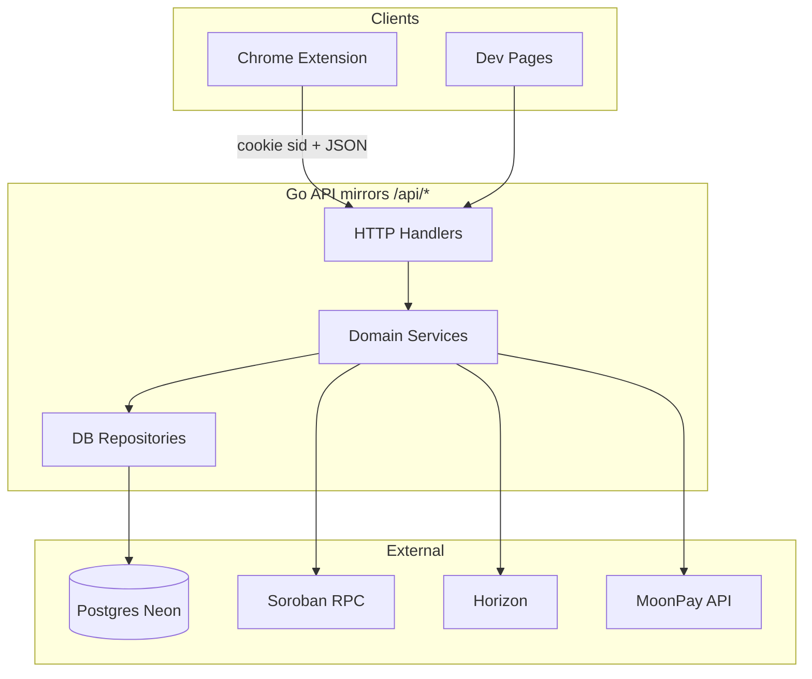
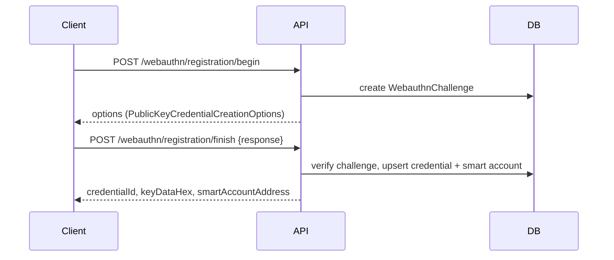
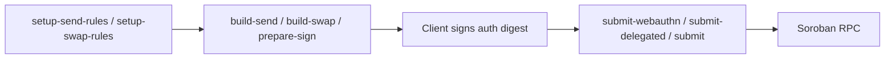

# Latch Go Port Guide

**Audience:** Go developers and AI coding agents porting the Latch Next.js `/api/*` backend.

**Companion files:**

| File | Purpose |
|------|---------|
| [`LATCH_GO_PORT_API_SPEC.json`](LATCH_GO_PORT_API_SPEC.json) | OpenAPI 3.1 + DB/env/lib extensions (machine-readable) |
| [`LATCH_GO_PORT_ENV.example`](LATCH_GO_PORT_ENV.example) | Annotated `.env` template with Required/Optional/Dev-only labels |
| [`LATCH_API_SWAP_ENDPOINTS_SPEC.md`](LATCH_API_SWAP_ENDPOINTS_SPEC.md) | Swap-specific pitfalls and multi-auth entry requirements |
| [`prisma/schema.prisma`](prisma/schema.prisma) | Database schema source of truth |

**Scope:** 58 route files, 66+ HTTP handlers under `/api/*`. Extension-verified. Does **not** cover mobile `wallet-backend` `/v1/*` (different `{ data }` / `{ error: { code, message } }` envelope).

**Compatibility rule:** Preserve exact paths, HTTP methods, JSON field names, and status codes. Internal improvements (DB transactions, validation) are fine; contract changes are not.

---

## Table of Contents

1. [Architecture Overview](#1-architecture-overview)
2. [Environment Configuration](#2-environment-configuration)
3. [Database Guide](#3-database-guide)
4. [Authentication and Sessions](#4-authentication-and-sessions)
5. [Soroban Domain Logic](#5-soroban-domain-logic)
6. [Error Response Conventions](#6-error-response-conventions)
7. [Shared Type Catalog](#7-shared-type-catalog)
8. [Endpoint Reference](#8-endpoint-reference)
9. [Testing Strategy](#9-testing-strategy)
10. [Go Project Structure and Agent Guidelines](#10-go-project-structure-and-agent-guidelines)

---

## 1. Architecture Overview



### Lib-to-Go package mapping (port priority)

| TypeScript (`lib/`) | Go package |
|---------------------|------------|
| `soroban-transaction-build.ts` | `internal/soroban/build` |
| `soroban-transaction-submit.ts` | `internal/soroban/submit` |
| `soroban-context-rules.ts` | `internal/soroban/contextrules` |
| `soroban-setup-signers.ts` | `internal/soroban/setupsigners` |
| `bundler-config.ts`, `bundler-delegated-auth.ts` | `internal/bundler` |
| `delegated-*.ts` | `internal/delegated` |
| `webauthn-server.ts`, `webauthn.ts` | `internal/webauthn` |
| `session.ts` | `internal/session` |
| `smart-account-factory-*.ts` | `internal/smartaccount` |
| `multisig-*.ts` | `internal/multisig` |
| `on-ramp/*` | `internal/onramp` |
| `sign-payload/store.ts` | `internal/signpayload` |
| `transaction/prepareExternalSign.ts` | `internal/transaction/preparesign` |
| `swap-routers.ts` | `internal/swap/routers` |

### Recommended port order

1. `config.Validate()` + env loading
2. Session middleware + DB repositories
3. Transaction build/submit (highest extension traffic)
4. Smart account deploy + context rules
5. WebAuthn ceremony
6. Multisig drafts/proposals
7. On-ramp (dev-only)

---

## 2. Environment Configuration

Copy [`LATCH_GO_PORT_ENV.example`](LATCH_GO_PORT_ENV.example) to `.env`. Missing config must **fail loudly at startup**, not silently at runtime.

### 2.1 Variable categories

| Category | Variables | Required when | Failure if missing |
|----------|-----------|---------------|-------------------|
| **Database** | `DATABASE_URL`, `DIRECT_URL` | Any DB-backed route | Server refuses start |
| **Bundler** | `BUNDLER_SECRET` | Tx build/submit, deploy, setup-rules | 500 `internal_error` — **most common break** |
| **Soroban testnet** | `NEXT_PUBLIC_RPC_URL`, `NEXT_PUBLIC_NETWORK_PASSPHRASE` | Default network routes | 500 on build/submit |
| **Soroban mainnet** | `MAINNET_RPC_URL`, `MAINNET_NETWORK_PASSPHRASE` | `network=mainnet` requests | 400 `invalid_network` or 500 |
| **Contracts** | `NEXT_PUBLIC_FACTORY_ADDRESS`, `NEXT_PUBLIC_VERIFIER_ADDRESS`, `NEXT_PUBLIC_WEBAUTHN_VERIFIER_ADDRESS` | Deploy, submit-webauthn, phantom | 500 with contract name |
| **Demo** | `NEXT_PUBLIC_COUNTER_ADDRESS` | `build`, `build-delegated`, counter proposals | 500 on those routes |
| **Assets** | `NEXT_PUBLIC_NATIVE_SAC_ADDRESS`, `NEXT_PUBLIC_USDC_SAC_ADDRESS` | `build-send`, `balances`, `setup-send-rules` | 400/500 |
| **WebAuthn** | `WEBAUTHN_RP_ID`, `WEBAUTHN_ORIGIN` | `/api/webauthn/*`, multisig WebAuthn | 500 `config_error` |
| **Extension CORS** | `API_CORS_ALLOWED_ORIGINS`, `WEBAUTHN_EXTENSION_IDS` | Extension `credentials: include` | CORS preflight fails |
| **MoonPay** | `MOONPAY_SECRET_KEY`, `MOONPAY_POOL_G_ADDRESS`, etc. | `/api/on-ramp/*` (dev only) | 500 `config_error` |
| **Legacy** | `LEGACY_DELEGATED_SIGNER_SECRET` | On-chain rules reference old G | 409 `SIGNER_MISMATCH` |

### 2.2 Startup validation (implement in Go)

```go
type Config struct {
    DatabaseURL      string
    DirectURL        string
    BundlerSecret    string
    RpcURL           string
    NetworkPassphrase string
    // ...
}

type ConfigError struct {
    Field   string
    Message string
    Fatal   bool
}

func (c *Config) Validate(env string) []ConfigError {
    var errs []ConfigError
    if c.BundlerSecret == "" {
        errs = append(errs, ConfigError{
            Field: "BUNDLER_SECRET", Message: "transaction routes disabled", Fatal: env == "production",
        })
    }
    if c.DatabaseURL != "" && !strings.Contains(c.DatabaseURL, "pgbouncer=true") {
        errs = append(errs, ConfigError{
            Field: "DATABASE_URL", Message: "must include pgbouncer=true for Neon pooler", Fatal: true,
        })
    }
    return errs
}
```

**Rules:**

- **Fail-fast in production:** exit non-zero if `BUNDLER_SECRET` or `DATABASE_URL` missing
- **Degraded dev mode:** allow starting without MoonPay if `NODE_ENV != production`
- **Cross-check:** `BUNDLER_SECRET` public G must match extension `PLASMO_PUBLIC_LATCH_FEE_PAYER_G` — mismatch causes 409 `SIGNER_MISMATCH` on submit
- **Neon DSN split:** `DATABASE_URL` = pooled + `pgbouncer=true`; `DIRECT_URL` = direct, no pooler (migrations only)
- **Never log or return:** `BUNDLER_SECRET`, `MOONPAY_SECRET_KEY`, `DATABASE_URL` passwords

### 2.3 Dev vs production

| Concern | Development | Production |
|---------|-------------|------------|
| On-ramp (`/api/on-ramp/*`) | Enabled | 403 `forbidden` |
| `build-sign-demo` | Enabled | 403 `forbidden` |
| WebAuthn LAN | `ALLOWED_DEV_ORIGINS`, `WEBAUTHN_DEV_TRUST_REQUEST_HOST` | Not used |
| Friendbot funding | Auto-fund bundler G on testnet | N/A |

### 2.4 Per-endpoint env dependency matrix

| Endpoint | Required env |
|----------|-------------|
| `POST /api/transaction/build-send` | `BUNDLER_SECRET`, RPC URL, passphrase, SAC addresses |
| `POST /api/transaction/build-swap` | `BUNDLER_SECRET`, RPC URL, passphrase, mainnet vars if `network=mainnet` |
| `POST /api/transaction/submit-webauthn` | `BUNDLER_SECRET`, `NEXT_PUBLIC_WEBAUTHN_VERIFIER_ADDRESS` |
| `POST /api/transaction/submit-delegated` | `BUNDLER_SECRET`, RPC URL, passphrase |
| `POST /api/transaction/prepare-sign` | `BUNDLER_SECRET`, network-specific RPC |
| `POST /api/smart-account/setup-send-rules` | `BUNDLER_SECRET`, verifiers, SAC addresses |
| `POST /api/smart-account/setup-swap-rules` | `BUNDLER_SECRET`, `NEXT_PUBLIC_WEBAUTHN_VERIFIER_ADDRESS` |
| `POST /api/smart-account/freighter` | `BUNDLER_SECRET`, `NEXT_PUBLIC_FACTORY_ADDRESS` |
| `POST /api/webauthn/registration/finish` | `WEBAUTHN_*`, `BUNDLER_SECRET`, `NEXT_PUBLIC_FACTORY_ADDRESS` |
| `POST /api/on-ramp/session` | `DATABASE_URL`, `MOONPAY_SECRET_KEY`, `MOONPAY_POOL_G_ADDRESS` |
| `GET /api/accounts` | `DATABASE_URL` |
| All `/api/multisig/proposals/*` execute/refresh | `BUNDLER_SECRET`, `NEXT_PUBLIC_WEBAUTHN_VERIFIER_ADDRESS` |

Full per-route list: see `x-latch-env-required` on each path in [`LATCH_GO_PORT_API_SPEC.json`](LATCH_GO_PORT_API_SPEC.json).

### 2.5 Secret handling

| Prefix | Safe in responses? | Notes |
|--------|-------------------|-------|
| `BUNDLER_SECRET`, `MOONPAY_SECRET_KEY` | **Never** | Server-only |
| `DATABASE_URL` | **Never** | Contains password |
| `NEXT_PUBLIC_*` | Yes | Extension reads client-side |
| `WEBAUTHN_RP_ID`, `WEBAUTHN_ORIGIN` | No | Server ceremony config |

---

## 3. Database Guide

**Provider:** PostgreSQL on Neon. **ORM source:** Prisma (port to `sqlc` or `pgx`).

### 3.1 Migrations (apply in order)

1. `prisma/migrations/20260428100157_init_neon/migration.sql` — users, sessions, webauthn, smart_accounts
2. `prisma/migrations/20260602101834_multisig_service/migration.sql` — multisig accounts, members, proposals, approvals
3. `prisma/migrations/20260603120000_multisig_draft/migration.sql` — drafts, draft members
4. `prisma/migrations/20260618120000_sign_payloads/migration.sql` — sign_payloads (JSONB)
5. `prisma/migrations/20260625120000_on_ramp_intents/migration.sql` — on_ramp_intents

### 3.2 Models (14 tables)

| Model | Table | ID strategy | Timestamp type |
|-------|-------|-------------|----------------|
| `User` | `users` | UUID (app) | BIGINT ms |
| `Session` | `sessions` | UUID (cookie `sid`) | BIGINT ms |
| `WebauthnCredential` | `webauthn_credentials` | UUID | BIGINT ms |
| `SmartAccount` | `smart_accounts` | UUID | BIGINT ms |
| `WebauthnChallenge` | `webauthn_challenges` | UUID | BIGINT ms |
| `AccountSigner` | `account_signers` | CUID | BIGINT ms |
| `MultisigDraft` | `multisig_drafts` | CUID | BIGINT ms |
| `MultisigDraftMember` | `multisig_draft_members` | CUID | BIGINT ms |
| `MultisigAccount` | `multisig_accounts` | CUID | BIGINT ms |
| `MultisigMember` | `multisig_members` | CUID | BIGINT ms |
| `MultisigProposal` | `multisig_proposals` | CUID | BIGINT ms |
| `MultisigApproval` | `multisig_approvals` | CUID | BIGINT ms |
| `SignPayload` | `sign_payloads` | `sp_` + 32 hex | TIMESTAMP(3) |
| `OnRampIntent` | `on_ramp_intents` | UUID | TIMESTAMP(3) |

### 3.3 Critical conventions

- **Booleans as INT:** `deployed`, `backed_up` use `0`/`1`, not Postgres boolean
- **No DB enums:** all discriminators are `TEXT` validated in application code
- **Binary columns:** `credential_id_bytes`, `cose_public_key`, `p256_raw_public_key` → `[]byte` in Go
- **JSON in TEXT:** `operation_params_json`, `auth_entries_xdr_json` → parse with `encoding/json`
- **Sign payload ID:** `sp_` + `crypto.randomBytes(16).hex`

### 3.4 Application string enums

| Domain | Field | Values |
|--------|-------|--------|
| WebAuthn challenge | `purpose` | `registration`, `authentication`, `multisig_draft_register:{draftId}`, `multisig_draft_auth:{draftId}` |
| Account signer | `signer_type` | `backup_passkey_intent`, `webauthn_credential`, `delegated`, ... |
| Multisig draft | `status` | `collecting`, `deployed` |
| Draft member | `member_type` | `webauthn`, `delegated`, `ed25519` |
| Draft member | `source` | `creator`, `invite` |
| Proposal | `operation_kind` | `counter_increment`, `sac_transfer` |
| Proposal | `status` | `pending`, `executed`, `expired`, `cancelled` |
| Approval | `approval_type` | `webauthn`, `delegated` |
| On-ramp | `status` | `created`, `pending`, `completed`, `failed` |

### 3.5 Query patterns to replicate

**Session bootstrap (transaction):**
```sql
INSERT INTO users (id, created_at) VALUES ($1, $2);
INSERT INTO sessions (id, user_id, created_at, expires_at) VALUES ($3, $1, $2, $4);
```

**Challenge lookup:**
```sql
SELECT * FROM webauthn_challenges
WHERE user_id = $1 AND purpose = $2
ORDER BY created_at DESC LIMIT 1;
```

**Member replace (wrap in transaction in Go — improvement over TS):**
```sql
DELETE FROM multisig_members WHERE multisig_account_id = $1;
INSERT INTO multisig_members (...) VALUES ...;
```

**Approval upsert:**
```sql
INSERT INTO multisig_approvals (proposal_id, member_id, ...)
ON CONFLICT (proposal_id, member_id) DO UPDATE SET ...;
```

**Sign payload consume-on-read:**
```sql
UPDATE sign_payloads SET consumed_at = NOW() WHERE id = $1 AND consumed_at IS NULL;
```

**Account signer manual upsert (no unique constraint):**
```sql
SELECT * FROM account_signers WHERE smart_account_address = $1 AND signer_type = $2 LIMIT 1;
-- then UPDATE or INSERT
```

---

## 4. Authentication and Sessions

### 4.1 Session cookie (`sid`)

Source: [`lib/session.ts`](lib/session.ts)

- Cookie name: `sid`
- TTL: 30 days, sliding refresh on each request
- Auto-creates anonymous `User` + `Session` if missing
- Attributes: `httpOnly`, `path=/`, `SameSite=None` when extension CORS enabled (via `API_CORS_ALLOWED_ORIGINS`)

### 4.2 Auth modes by route

| Mode | Description | Routes |
|------|-------------|--------|
| `none` | Public; crypto auth is client-side | Most transaction, smart-account routes |
| `session` | Requires valid `sid` cookie | accounts, webauthn, multisig owner routes |
| `session+ownership` | Session + resource belongs to `userId` | recovery, multisig proposals |
| `session+creator` | Session + draft `creatorUserId` match | multisig draft management |
| `invite_token` | URL `{token}` param, no login | `/api/multisig/join/{token}/*` |
| `dev_only` | 403 when `NODE_ENV=production` | on-ramp, build-sign-demo |

### 4.3 Signer types

```typescript
type SignerType = "passkey" | "phantom" | "freighter";
```

| Signer | On-chain representation | Submit endpoint |
|--------|----------------------|-----------------|
| `passkey` | `External(webauthnVerifier, keyDataHex)` | `submit-webauthn` |
| `phantom` | `External(ed25519Verifier, publicKeyHex)` | `submit` |
| `freighter` | `Delegated(userG)` | `submit-delegated` |

### 4.4 WebAuthn ceremony flow



RP context from `WEBAUTHN_RP_ID` / `WEBAUTHN_ORIGIN`. Extension origins via `chromeExtensionId` + `WEBAUTHN_EXTENSION_IDS`.

---

## 5. Soroban Domain Logic

### 5.1 Transaction pipeline



### 5.2 Bundler fee-payer model

- Transaction **source** = bundler public G (`BUNDLER_SECRET`)
- Smart account C-address is the invoked contract user
- Passkey accounts often have **no linked G-address**
- Bundler may also sign delegated `__check_auth` entries server-side

### 5.3 Context rule discovery

`discoverContextRule(smartAccount, targetContractId)`:

1. Prefer **matched** `CallContract(target)` rule
2. Fallback to **Default** rule (id 0) — required for DEX swaps
3. `requireMatchedContextRule: true` → 409 `NO_CONTEXT_RULE`

Send rules (`CallContract(SAC)`) ≠ swap rules (`CallContract(Aquarius router)`).

### 5.4 BuildAuthTransactionResult fields

Critical response shape — preserve **exact field names**:

| Field | Type | Description |
|-------|------|-------------|
| `txXdr` | string | Base64 transaction envelope |
| `authEntryXdr` | string | Primary smart-account auth entry |
| `authEntriesXdr` | string[] | **All** auth entries (passkey + bundler G) |
| `smartAccountAuthEntryIndex` | int | Index of passkey/external entry |
| `delegatedNativeAuthEntryIndices` | int[] | Indices of G-address delegated entries |
| `delegatedGAuthEntrySynthesized` | bool | Server synthesized bundler G entry |
| `contextRuleId` | int | On-chain rule ID |
| `contextRuleIds` | int[] | All rule IDs in auth payload |
| `contextRuleDiscovery` | string | `matched` \| `default` \| `fallback` |
| `authDigestHex` | string | Hash client must sign |
| `signaturePayloadHex` | string | Full signature payload hex |
| `validUntilLedger` | int | Auth expiration ledger |
| `simulationResultXdr` | string | Soroban simulation result |
| `submitMethod` | string | `bundler-delegated` \| `delegated` \| `webauthn` |
| `gAddressPreimageXdr` | string? | Freighter delegated signing |
| `gAddressEntryTemplateXdr` | string? | Freighter delegated signing |

### 5.5 Swap-specific rules

See [`LATCH_API_SWAP_ENDPOINTS_SPEC.md`](LATCH_API_SWAP_ENDPOINTS_SPEC.md):

- `submit-webauthn` must merge **all** `authEntriesXdr[]` entries
- Server signs bundler delegated G rows when `delegatedGAuthEntrySynthesized=true`
- Aquarius testnet router: `CBCFTQSPDBAIZ6R6PJQKSQWKNKWH2QIV3I4J72SHWBIK3ADRRAM5A6GD`
- 409 `SIGNER_MISMATCH` when context rule points at wrong G

### 5.6 Highest-value functions to port first

1. `buildAuthTransaction()` — [`lib/soroban-transaction-build.ts`](lib/soroban-transaction-build.ts)
2. `simulateAndExtractAuth()` — [`lib/transaction/simulateAndExtractAuth.ts`](lib/transaction/simulateAndExtractAuth.ts)
3. `submitWithBundler()` — [`lib/soroban-transaction-submit.ts`](lib/soroban-transaction-submit.ts)
4. `discoverContextRule()` — [`lib/soroban-context-rules.ts`](lib/soroban-context-rules.ts)
5. `buildWebAuthnAuthPayload()` — [`lib/webauthn.ts`](lib/webauthn.ts)
6. `signBundlerDelegatedAuthEntry()` — [`lib/bundler-delegated-auth.ts`](lib/bundler-delegated-auth.ts)

Use `github.com/stellar/go` + Soroban RPC client.

---

## 6. Error Response Conventions

### 6.1 Canonical envelope (use everywhere in Go)

```json
{
  "error": "Human-readable message",
  "code": "snake_case_code",
  "message": "Human-readable message"
}
```

Source: [`lib/api-errors.ts`](lib/api-errors.ts). `error` and `message` are duplicates for legacy compat.

### 6.2 Common error codes

| Code | HTTP | When |
|------|------|------|
| `validation_error` | 400 | Missing/invalid body fields |
| `invalid_network` | 400 | Bad `network` field |
| `invalid_xdr` | 400 | Unparseable XDR |
| `simulation_failed` | 400 | Soroban sim error |
| `NO_CONTEXT_RULE` | 409 | No matching context rule |
| `SIGNER_MISMATCH` | 409 | Rule signers don't match signerType |
| `signer_already_exists` | 409 | Duplicate signer in setup-swap-rules |
| `forbidden` | 403 | On-ramp in production |
| `not_found` | 404 | Resource missing |
| `expired` | 410 | Sign-payload TTL exceeded |
| `internal_error` | 500 | Missing `BUNDLER_SECRET`, etc. |
| `config_error` | 500 | MoonPay/WebAuthn misconfiguration |
| `database_unavailable` | 503 | DB connection failure |

### 6.3 Legacy routes (omit `code` today)

Go should **standardize** on canonical envelope. Flag these for contract tests:

- Most `/api/smart-account/*`, `/api/transaction/build*`, `/api/transaction/submit*`
- Most `/api/webauthn/*`, `/api/multisig/*`
- `/api/accounts`

Newer routes already use canonical: `prepare-sign`, `on-ramp`, `sign-payload`, `setup-swap-rules`, `submit-delegated`.

---

## 7. Shared Type Catalog

Full JSON Schema definitions in [`LATCH_GO_PORT_API_SPEC.json`](LATCH_GO_PORT_API_SPEC.json) `components/schemas`.

### SignPayloadBody

```json
{
  "network": "testnet",
  "smartAccountAddress": "C...",
  "unsignedTxXdr": "AAAA...",
  "callback": "https://...",
  "requestId": "optional",
  "origin": "optional",
  "submit": true
}
```

### OnRampIntentResponse

```json
{
  "id": "uuid",
  "memoId": "string",
  "destinationCAddress": "C...",
  "status": "created|pending|completed|failed",
  "moonpayTransactionId": null,
  "fiatAmount": "25",
  "fiatCode": "USD",
  "createdAt": "2026-06-29T00:00:00.000Z",
  "updatedAt": "2026-06-29T00:00:00.000Z"
}
```

### MultisigSignerInit

```json
{ "type": "webauthn", "keyDataHex": "...", "label": "Alice" }
{ "type": "delegated", "gAddress": "G...", "label": "Bob" }
```

### SerializedDraft

```json
{
  "id": "cuid",
  "threshold": 2,
  "accountSaltHex": "64-char hex",
  "inviteToken": "base64url",
  "status": "collecting",
  "predictedAddress": "C...",
  "smartAccountAddress": null,
  "createdAt": 1719667200000,
  "expiresAt": 1720272000000,
  "members": [],
  "validMemberCount": 2,
  "canDeploy": false
}
```

### SubmitResult

```json
{ "hash": "tx hash hex", "status": "SUCCESS" }
```

---

## 8. Endpoint Reference

**Machine-readable spec:** [`LATCH_GO_PORT_API_SPEC.json`](LATCH_GO_PORT_API_SPEC.json) — 58 paths, 66 handlers.

Each entry includes: `summary`, request/response schemas, `x-latch-source-file`, `x-latch-auth`, `x-latch-env-required`, `x-latch-db-models`.

### 8.1 accounts (2 handlers)

| Method | Path | Auth | DB | Source |
|--------|------|------|-----|--------|
| GET | `/api/accounts` | session | SmartAccount | `app/api/accounts/route.ts` |
| POST | `/api/accounts/set-active` | none | — | `app/api/accounts/set-active/route.ts` |

**GET /api/accounts** — List passkey smart accounts for session user.

Response: `{ accounts: [{ smartAccountAddress, credentialId, deployed, createdAt }] }`

**POST /api/accounts/set-active** — Sets non-httpOnly `activeSmartAccountAddress` cookie.

Body: `{ smartAccountAddress }` → `{ ok: true }`

### 8.2 counter (1 handler)

| GET | `/api/counter` | none | Demo on-chain counter u32 value |

### 8.3 recovery (1 handler)

| POST | `/api/recovery/backup-passkey` | session+ownership | SmartAccount, AccountSigner |

Body: `{ smartAccountAddress, label? }` → `{ ok: true, next: "instructions" }`

### 8.4 sign-payload (2 handlers)

| POST | `/api/sign-payload` | none | SignPayload | Creates `sp_*` ref, TTL 60–3600s |
| GET | `/api/sign-payload/{payloadRef}` | none | SignPayload | Consume-on-read; 410 if expired |

### 8.5 webauthn (5 handlers)

| POST | `/api/webauthn/registration/begin` | session | WebauthnChallenge |
| POST | `/api/webauthn/registration/finish` | session | + deploy smart account |
| POST | `/api/webauthn/authentication/begin` | session | |
| POST | `/api/webauthn/authentication/finish` | session | Returns accounts list |
| GET | `/api/webauthn/credentials` | session | List credential IDs |

Registration finish response: `{ credentialId, keyDataHex, saltHex, smartAccountAddress, deployed, alreadyDeployed, determinismCheck }`

### 8.6 smart-account (11 handlers)

| Method | Path | Notes |
|--------|------|-------|
| GET/POST | `/api/smart-account` | Legacy deploy (GET returns config) |
| GET | `/api/smart-account/balances` | Query: `smartAccountAddress`, `all=1` |
| GET | `/api/smart-account/context-rules` | Query: `address`, `network` |
| GET/POST | `/api/smart-account/factory` | Ed25519 factory predict/deploy |
| GET/POST | `/api/smart-account/freighter` | Delegated G factory |
| GET/POST | `/api/smart-account/webauthn` | Passkey factory |
| POST | `/api/smart-account/setup-send-rules` | Per-asset `CallContract(SAC)` rules |
| POST | `/api/smart-account/setup-swap-rules` | Per-router swap rules |

### 8.7 transaction (9 handlers)

| Method | Path | Notes |
|--------|------|-------|
| POST | `/api/transaction/build` | Counter increment demo |
| POST | `/api/transaction/build-send` | SAC transfer; 409 `NO_CONTEXT_RULE` |
| POST | `/api/transaction/build-swap` | Aquarius swap; multi-auth |
| POST | `/api/transaction/build-delegated` | Freighter counter demo |
| POST | `/api/transaction/build-sign-demo` | **dev_only** |
| POST | `/api/transaction/prepare-sign` | External unsigned XDR |
| POST | `/api/transaction/submit` | Phantom/Ed25519 path |
| POST | `/api/transaction/submit-webauthn` | Passkey path; merge all auth entries |
| POST | `/api/transaction/submit-delegated` | Freighter path |

### 8.8 on-ramp (4 handlers, dev_only)

| POST | `/api/on-ramp/session` | session+dev | Creates OnRampIntent + MoonPay session |
| GET | `/api/on-ramp/pool` | dev | Pool balance + recent txs |
| GET/PATCH | `/api/on-ramp/intent/{id}` | dev | Intent status |

### 8.9 multisig (30 handlers)

**Accounts:** `GET /accounts`, `POST /accounts/register`, `POST /accounts/draft`, `POST /accounts/deploy`

**Drafts:** `POST/GET /drafts`, `GET/PATCH /drafts/{id}`, members CRUD, predict, deploy, WebAuthn ceremony (4 routes)

**Join (invite token):** `GET /join/{token}`, members, WebAuthn ceremony (4 routes)

**Proposals:** `GET/POST /proposals`, `GET /proposals/{id}`, refresh, execute, approve webauthn, approve delegated begin/finish

**Create proposal body:**
```json
{
  "smartAccountAddress": "C...",
  "operationKind": "counter_increment|sac_transfer",
  "recipient": "C...",
  "amount": "1.0",
  "assetId": "native"
}
```

**Execute:** Requires threshold approvals; returns `{ hash, status }`.

---

## 9. Testing Strategy

**Mandatory for Go agent.** Three layers:

### 9.1 Contract tests (HTTP golden files)

Record request/response from running Next.js API. Go tests assert identical JSON shape and status codes.

```go
func TestBuildSendContract(t *testing.T) {
    golden := loadGolden("testdata/build-send-passkey.json")
    resp := post("/api/transaction/build-send", golden.Request)
    assertJSONShape(t, resp, golden.ResponseSchema)
    assert.Equal(t, 200, resp.StatusCode)
}
```

### 9.2 Domain unit tests (XDR fixtures)

- `buildAuthTransaction` with passkey + bundler delegated entry synthesis
- `submit-webauthn` multi-entry merge
- `discoverContextRule` matched vs default
- Context rule signer validation (`SIGNER_MISMATCH`)

Use `stellar/go` with testnet or mocked RPC.

### 9.3 DB integration tests

- testcontainers Postgres
- Apply 5 migrations
- Session bootstrap transaction
- Draft deploy → MultisigAccount creation
- Proposal approval upsert on `(proposal_id, member_id)`
- Sign payload consume-on-read

### 9.4 Minimum test cases per domain

| Domain | Cases |
|--------|-------|
| Transaction | passkey send build+submit; passkey swap build+submit; Freighter delegated submit |
| Smart account | factory predict/deploy; setup-send-rules; setup-swap-rules |
| WebAuthn | registration + authentication round-trip |
| Multisig | draft → deploy → proposal → approve → execute |
| Env | startup fails without `BUNDLER_SECRET` in production; on-ramp 403 in production |
| Errors | All routes return `{ error, code, message }` (canonical) |

### 9.5 CI recommendation

During migration window, run contract tests against **both** Next.js (reference) and Go implementations.

---

## 10. Go Project Structure and Agent Guidelines

### 10.1 Recommended layout

```
latch-go/
├── cmd/server/main.go
├── internal/
│   ├── config/          # env loading + Validate()
│   ├── handler/         # thin HTTP handlers per domain
│   ├── middleware/      # session, CORS, dev-only guard
│   ├── session/
│   ├── db/
│   │   ├── migrate/     # embed prisma migration SQL
│   │   ├── models/
│   │   └── repo/        # session, webauthn, multisig, onramp, signpayload
│   ├── soroban/         # build, submit, contextrules, setupsigners
│   ├── bundler/
│   ├── delegated/
│   ├── webauthn/
│   ├── smartaccount/
│   ├── multisig/
│   ├── onramp/
│   ├── transaction/
│   ├── swap/
│   └── api/             # error envelope helpers
├── migrations/          # symlink or copy from prisma/migrations
├── testdata/            # golden HTTP fixtures
└── sqlc.yaml            # optional
```

### 10.2 Handler pattern

```go
func (h *TransactionHandler) BuildSend(w http.ResponseWriter, r *http.Request) {
    var req BuildSendRequest
    if err := json.NewDecoder(r.Body).Decode(&req); err != nil {
        api.WriteError(w, 400, "validation_error", "invalid JSON")
        return
    }
    if err := req.Validate(); err != nil {
        api.WriteError(w, 400, "validation_error", err.Error())
        return
    }
    result, err := h.svc.BuildSend(r.Context(), req)
    if err != nil {
        api.WriteServiceError(w, err)
        return
    }
    api.WriteJSON(w, 200, result)
}
```

### 10.3 Agent coding rules

1. **Read source first:** Each handler maps to `app/api/.../route.ts` — read it before implementing
2. **Preserve field names:** Especially XDR fields (`authEntriesXdr`, `delegatedGAuthEntrySynthesized`)
3. **Never leak secrets:** `BUNDLER_SECRET` stays server-side
4. **Always simulate before submit:** Enforcing-mode Soroban simulation
5. **Standardize errors:** Use `{ error, code, message }` even where TS omits `code`
6. **Write tests:** At least one contract test per handler group before marking done
7. **Network param:** Accept `network: "testnet"|"mainnet"` in body; resolve server-side
8. **DB transactions:** Wrap member replace + deploy in explicit transactions
9. **CORS:** Implement credentialed CORS for extension origins from `API_CORS_ALLOWED_ORIGINS`
10. **Cross-reference JSON spec:** [`LATCH_GO_PORT_API_SPEC.json`](LATCH_GO_PORT_API_SPEC.json) for schemas

### 10.4 Compatibility checklist

Before declaring a route done:

- [ ] Path and method match spec exactly
- [ ] Request validation matches TS route
- [ ] Response JSON field names and types match
- [ ] Error codes and HTTP statuses match
- [ ] Required env vars documented and validated at startup
- [ ] DB operations match Prisma patterns
- [ ] Contract test passes against golden fixture
- [ ] No secrets in logs or responses

---

## Appendix A: Route file index

All 58 source files under `app/api/`:

```
accounts/route.ts, accounts/set-active/route.ts
counter/route.ts
recovery/backup-passkey/route.ts
sign-payload/route.ts, sign-payload/[payloadRef]/route.ts
webauthn/credentials/route.ts
webauthn/registration/begin/route.ts, webauthn/registration/finish/route.ts
webauthn/authentication/begin/route.ts, webauthn/authentication/finish/route.ts
smart-account/route.ts, smart-account/balances/route.ts
smart-account/context-rules/route.ts, smart-account/factory/route.ts
smart-account/freighter/route.ts, smart-account/webauthn/route.ts
smart-account/setup-send-rules/route.ts, smart-account/setup-swap-rules/route.ts
transaction/build/route.ts, transaction/build-send/route.ts
transaction/build-swap/route.ts, transaction/build-delegated/route.ts
transaction/build-sign-demo/route.ts, transaction/prepare-sign/route.ts
transaction/submit/route.ts, transaction/submit-webauthn/route.ts
transaction/submit-delegated/route.ts
on-ramp/session/route.ts, on-ramp/pool/route.ts, on-ramp/intent/[id]/route.ts
multisig/accounts/route.ts, multisig/accounts/register/route.ts
multisig/accounts/draft/route.ts, multisig/accounts/deploy/route.ts
multisig/drafts/route.ts, multisig/drafts/[id]/route.ts
multisig/drafts/[id]/members/route.ts
multisig/drafts/[id]/members/[memberId]/route.ts
multisig/drafts/[id]/predict/route.ts, multisig/drafts/[id]/deploy/route.ts
multisig/drafts/[id]/webauthn/register/begin/route.ts
multisig/drafts/[id]/webauthn/register/finish/route.ts
multisig/drafts/[id]/webauthn/authenticate/begin/route.ts
multisig/drafts/[id]/webauthn/authenticate/finish/route.ts
multisig/join/[token]/route.ts, multisig/join/[token]/members/route.ts
multisig/join/[token]/webauthn/register/begin/route.ts
multisig/join/[token]/webauthn/register/finish/route.ts
multisig/join/[token]/webauthn/authenticate/begin/route.ts
multisig/join/[token]/webauthn/authenticate/finish/route.ts
multisig/proposals/route.ts, multisig/proposals/[id]/route.ts
multisig/proposals/[id]/refresh/route.ts, multisig/proposals/[id]/execute/route.ts
multisig/proposals/[id]/approve/webauthn/route.ts
multisig/proposals/[id]/approve/delegated/begin/route.ts
multisig/proposals/[id]/approve/delegated/finish/route.ts
```

## Appendix B: Regenerating the JSON spec

```bash
node scripts/generate-go-port-spec.mjs
```

Updates [`LATCH_GO_PORT_API_SPEC.json`](LATCH_GO_PORT_API_SPEC.json) from the generator in `scripts/`.
