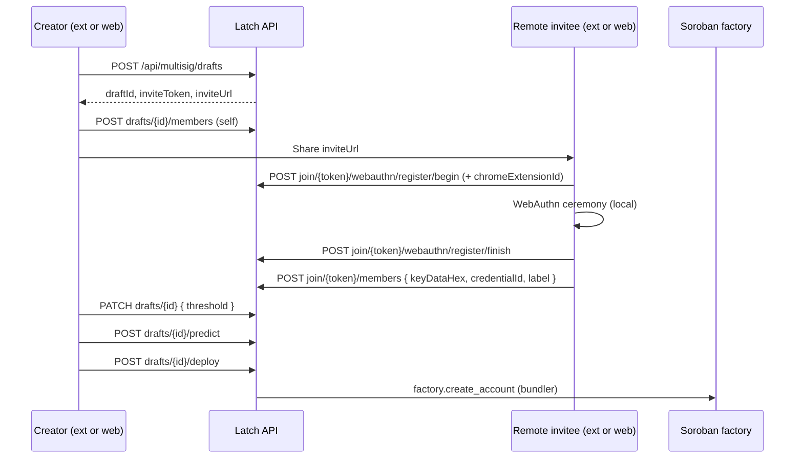

# Multisig creation flow — extension integration guide

This document describes how to implement **team wallet (multisig) creation** in the Latch Chrome extension using the same APIs as the web playground (`/multisig`). The server owns the draft; each signer contributes **public** material from **their own device**.

## Mental model

| Concept | Meaning |
|--------|---------|
| **Team wallet** | New Soroban C-address with M-of-N `AccountSignerInit` entries |
| **Draft** | Off-chain `MultisigDraft` + `MultisigDraftMember` rows until deploy |
| **Invite** | URL `/multisig/join/{inviteToken}` — no login required to add a signer |
| **keyDataHex** | WebAuthn on-chain material: `65-byte P-256 pubkey \|\| credentialId bytes` (hex) |
| **credentialId** | Base64url id from the authenticator — store in extension for later proposal approvals |
| **RP ID** | Web: `WEBAUTHN_RP_ID` / hostname. Extension: `chrome.runtime.id` |

**Critical:** Passkeys are bound to RP ID. A passkey created on `latch.example.com` is **not** the same as one created in `chrome-extension://<extensionId>`. Multisig members must sign with the **same RP context** they used when joining.

## End-to-end flow



## Phase 1 — Creator starts draft

### Create draft (authenticated)

```http
POST /api/multisig/drafts
Cookie: latch_session=...
```

Response:

```json
{
  "draft": {
    "id": "…",
    "threshold": 2,
    "accountSaltHex": "…",
    "inviteToken": "…",
    "status": "collecting",
    "members": [],
    "canDeploy": false
  },
  "inviteUrl": "https://host/multisig/join/{inviteToken}"
}
```

Resume latest collecting draft:

```http
GET /api/multisig/drafts?active=1
```

### Extension notes

- Use `fetch(..., { credentials: "include" })` so session cookies are sent.
- Ensure `WEBAUTHN_EXTENSION_IDS` and `API_CORS_ALLOWED_ORIGINS` include your extension origin.
- Persist `draft.id` locally (web uses `localStorage` key `latch-multisig-draft-id`).

## Phase 2 — Add members

### Creator adds self (authenticated)

```http
POST /api/multisig/drafts/{draftId}/members
Content-Type: application/json

{
  "label": "Alice",
  "memberType": "webauthn",
  "keyDataHex": "04…",
  "credentialId": "base64url…"
}
```

Delegated member:

```json
{
  "label": "Bob",
  "memberType": "delegated",
  "gAddress": "G…"
}
```

### Remote invitee (public, no session required)

1. `GET /api/multisig/join/{inviteToken}` — draft summary (fingerprints only).
2. Collect credentials (WebAuthn or Freighter).
3. `POST /api/multisig/join/{inviteToken}/members` — same body shape as creator route.

Invite page (web): `/multisig/join/{inviteToken}`.

### Remove member (creator only)

```http
DELETE /api/multisig/drafts/{draftId}/members/{memberId}
```

## WebAuthn ceremonies (extension-ready)

Every begin/finish body may include:

```json
{ "chromeExtensionId": "<32-char extension id>" }
```

Server sets `rpId = chromeExtensionId` and `origin = chrome-extension://{id}` when allowlisted.

### Join-only passkey registration (no personal smart account deploy)

| Step | Endpoint |
|------|----------|
| Begin | `POST /api/multisig/join/{token}/webauthn/register/begin` |
| Finish | `POST /api/multisig/join/{token}/webauthn/register/finish` |

Finish returns `{ credentialId, keyDataHex }` only — **does not** deploy a personal WebAuthn smart account.

### Join — use existing Latch passkey

| Step | Endpoint |
|------|----------|
| Begin | `POST /api/multisig/join/{token}/webauthn/authenticate/begin` |
| Finish | `POST /api/multisig/join/{token}/webauthn/authenticate/finish` |

- If invitee has a session with stored credentials, `allowCredentials` is populated.
- Otherwise discoverable auth is used.
- Finish builds `keyDataHex` from `WebauthnCredential` — **no** `SmartAccount` row required.
- If credential unknown: error → prompt “Create new passkey for this team wallet”.

### Creator passkey on draft (authenticated)

Same pattern under `/api/multisig/drafts/{draftId}/webauthn/...` (register/authenticate begin/finish). Registration finish optionally upserts `WebauthnCredential` for the session user.

### Client helper (web playground)

See `lib/multisig-passkey-ceremony.ts` — mirror this in the extension with `@simplewebauthn/browser` (`startRegistration` / `startAuthentication`).

### Extension storage after join

Store per team wallet (keyed by `multisigAccountId` or `smartAccountAddress` after deploy):

```ts
{
  memberId: string,           // from register API after deploy
  credentialId: string,       // base64url
  keyDataHex: string,         // for display / verification
  rpId: chrome.runtime.id,  // always extension id in ext
}
```

## Phase 3 — Threshold

```http
PATCH /api/multisig/drafts/{draftId}
Content-Type: application/json

{ "threshold": 2 }
```

Rules: `1 <= threshold <= member count`. UI should only offer deploy when `draft.canDeploy === true` (≥2 valid webauthn/delegated signers).

## Phase 4 — Predict & deploy

### Predict address (creator)

```http
POST /api/multisig/drafts/{draftId}/predict
```

Returns `smartAccountAddress`, updates `draft.predictedAddress`.

### Deploy (creator, requires `BUNDLER_SECRET`)

```http
POST /api/multisig/drafts/{draftId}/deploy
```

- Deploys via factory using draft `accountSaltHex`, `threshold`, and members.
- Upserts `MultisigAccount` + `MultisigMember` (includes `credentialId` for webauthn).
- Sets draft `status` to `deployed`.

Idempotent if already deployed.

## Signer material reference

| memberType | Collect | On-chain |
|------------|---------|----------|
| `webauthn` | `keyDataHex`, `credentialId` | `External(WebAuthn, key_data)` |
| `delegated` | `gAddress` | `Delegated(G…)` |
| `ed25519` | `publicKeyHex` | Not deployable yet |

**Do not collect:** personal C-addresses, seeds, private keys.

## Spending (after deploy)

Creation only registers public keys. Approvals use existing proposal APIs:

- `POST /api/multisig/proposals` — create proposal
- `POST /api/multisig/proposals/{id}/approve/webauthn` — passkey approval (`allowCredentials: [{ id: credentialId }]`)
- `POST /api/multisig/proposals/{id}/approve/delegated/...` — G-address path
- `POST /api/multisig/proposals/{id}/execute` — when threshold met

Extension must use the **same RP ID** as when the member joined.

## Environment checklist

| Variable | Purpose |
|----------|---------|
| `WEBAUTHN_RP_ID` | Web ceremonies |
| `WEBAUTHN_ORIGIN` | Web origin |
| `WEBAUTHN_EXTENSION_IDS` | Allowlist extension ids for `chromeExtensionId` |
| `API_CORS_ALLOWED_ORIGINS` | `chrome-extension://…` for credentialed fetch |
| `NEXT_PUBLIC_FACTORY_ADDRESS` | Factory contract |
| `BUNDLER_SECRET` | Deploy transactions |

## Suggested extension UI screens

1. **Create team wallet** — `POST /drafts`, show invite link (copy / QR).
2. **Add yourself** — passkey or Freighter via draft webauthn routes + `POST …/members`.
3. **Members list** — poll `GET /drafts/{id}` until remote members appear (`source: "invite"`).
4. **Threshold picker** — `PATCH` draft.
5. **Deploy** — predict → show C-address → deploy → save `smartAccountAddress` + local `credentialId` map.
5. **Join flow (invitee)** — deep link to join route or extension page calling `join/{token}/…` APIs with `chromeExtensionId`.

## Error handling

| HTTP | Meaning |
|------|---------|
| 404 | Invalid/expired invite or draft |
| 409 | Duplicate signer on draft |
| 400 | Validation (bad keyData, threshold, ceremony config) |

Ceremony config errors usually mean extension id not in `WEBAUTHN_EXTENSION_IDS` or conflicting `chromeExtensionId` vs Origin header.

## Related code (Latch repo)

- `lib/multisig-draft.ts` — draft helpers, serialization
- `lib/multisig-draft-webauthn.ts` — join/creator ceremonies
- `lib/multisig-passkey-ceremony.ts` — browser client
- `app/api/multisig/drafts/**` — creator APIs
- `app/api/multisig/join/**` — public invite APIs
- `lib/smart-account-factory-multisig.ts` — factory params
